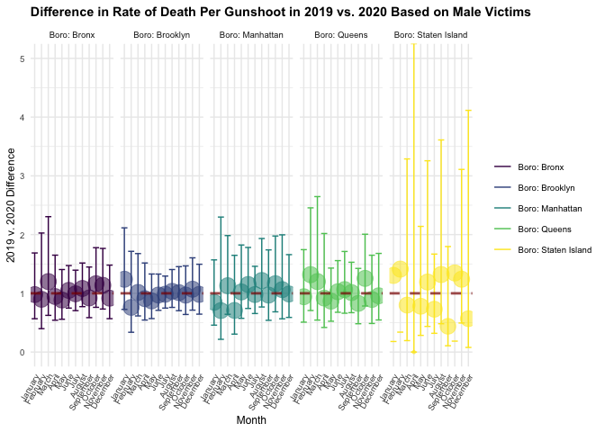
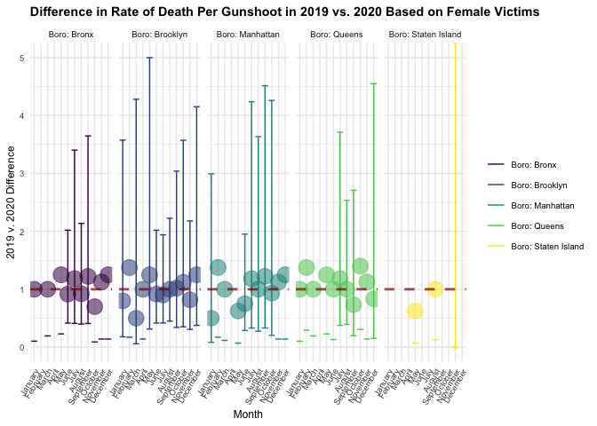
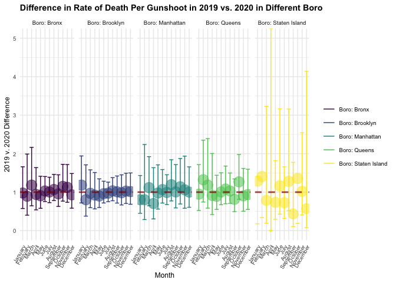

Modeling\_Poisson\_Analysis
================
tianwei zhao
12/9/2021

``` r
library(tidyverse)
library(dplyr)
```

## Goal

My goal was to compare the rate of death in a gunshoot in recent
years,such as 2019 to the same month in 2020 (e.g., rate of death in
January 2019 v. rate of death in January 2020).Additionally,I stratified
these rate ratio estimates by borough.

To accomplish this, I filtered the tidy data to create one dataset for
male victims and one for female victims.I created nested datasets by
month, and, in each of these datasets, I mapped Poisson models to
extract rate ratio estimates for number of death in each borough.
Finally, I unnessted these models to extract the desired coefficients:
rate ratios and standard errors (used to compute 95% confidence
intervals).

tidy functions to filter either male or female victims.

``` r
mydata = read.csv("data/NYPD_Shooting_Incident_Data_Clean.csv") %>% 
mutate(
    statistical_murder_flag = as.character(statistical_murder_flag),
    statistical_murder_flag = recode(statistical_murder_flag, "FALSE" = "1","TRUE" = "0")
  ) %>% 
  mutate(statistical_murder_flag = as.numeric(statistical_murder_flag)) 


male_based = mydata%>% 
  filter(vic_sex == "male")

female_based = mydata %>% 
  filter(vic_sex == "female")

month_df=
  tibble(
    month = 1:12,
    month_name = factor(month.name, ordered = TRUE, levels = month.name)
  )
```

### For male victims in differnent boro death rate

``` r
male_data = male_based %>%
  filter(year %in% c(2019,2020)) %>%
  mutate(boro = str_to_title(boro)) %>%
  group_by(year) %>%
  mutate(year = year - 2019) %>%
  nest(data = -month) %>%
  mutate(models = map(data, ~glm( statistical_murder_flag~ year:boro,
                                 family = "poisson", data = .x)),
         models = map(models, broom::tidy)) %>% 
  dplyr::select(-data) %>% 
  unnest(models) %>%
  dplyr::select(month, term, estimate, std.error, p.value) %>% 
  mutate(term = str_replace(term, "year:boro", "Boro: ")) %>% 
  left_join(month_df, by = "month") %>%
  dplyr::select(-month) %>%
  rename(month = month_name) %>%
  dplyr::select(month, everything())
```

``` r
male_data %>% 
  filter(term != "(Intercept)") %>%
  mutate(term = str_replace(term, "2019 v. 2020, ", "")) %>%
  ggplot(aes(x = month, y = exp(estimate), color = term)) + 
  geom_point(show.legend = FALSE, aes(size = estimate, alpha = .7)) +
  geom_errorbar(aes(ymin = exp(estimate - (1.96*std.error)), 
                    ymax = exp(estimate + (1.96*std.error)))) +
  geom_hline(yintercept = 1, linetype="dashed", 
                color = "darkred", size = 1, alpha = .7) +
  labs(
    title = "Difference in Rate of Death Per Gunshoot in 2019 vs. 2020 Based on Male Victims",
    x = "Month",
    y = "2019 v. 2020 Difference"
  ) +
  ylim(0, 5) +
  theme(legend.position="right", legend.title = element_blank(),
        text = element_text(size = 9),
        axis.text.x = element_text(angle = 60, hjust = 1, size = 7)) + 
  facet_grid(. ~ term)
```

<!-- -->

Based on the figure above, no majot discernable pattern was covered,
suggesting that rates of death per gunshoot did not differ between 2019
and 2020 in male victims. In part, this could be due to very wide
confidence intervals.

### For female victims in differnent boro death rate

``` r
female_data = female_based %>%
  filter(year %in% c(2019,2020)) %>%
  mutate(boro = str_to_title(boro)) %>%
  group_by(year) %>%
  mutate(year = year - 2019) %>%
  nest(data = -month) %>%
  mutate(models = map(data, ~glm( statistical_murder_flag~ year:boro,
                                 family = "poisson", data = .x)),
         models = map(models, broom::tidy)) %>% 
  dplyr::select(-data) %>% 
  unnest(models) %>%
  dplyr::select(month, term, estimate, std.error, p.value) %>% 
  mutate(term = str_replace(term, "year:boro", "Boro: ")) %>% 
  left_join(month_df, by = "month") %>%
  dplyr::select(-month) %>%
  rename(month = month_name) %>%
  dplyr::select(month, everything())
```

``` r
female_data %>% 
  filter(term != "(Intercept)") %>%
  mutate(term = str_replace(term, "2019 v. 2020, ", "")) %>%
  ggplot(aes(x = month, y = exp(estimate), color = term)) + 
  geom_point(show.legend = FALSE, aes(size = estimate, alpha = .7)) +
  geom_errorbar(aes(ymin = exp(estimate - (1.96*std.error)), 
                    ymax = exp(estimate + (1.96*std.error)))) +
  geom_hline(yintercept = 1, linetype="dashed", 
                color = "darkred", size = 1, alpha = .7) +
  labs(
    title = "Difference in Rate of Death Per Gunshoot in 2019 vs. 2020 Based on Female Victims",
    x = "Month",
    y = "2019 v. 2020 Difference"
  ) +
  ylim(0, 5) +
  theme(legend.position="right", legend.title = element_blank(),
        text = element_text(size = 9),
        axis.text.x = element_text(angle = 60, hjust = 1, size = 7)) + 
  facet_grid(. ~ term)
```

    ## Warning: Removed 4 rows containing missing values (geom_point).

<!-- -->

Based on the figure above, also no majot discernable pattern was
covered, suggesting that rates of death per gunshoot did not differ
between 2019 and 2020 in female victims.

## Summary

In conclusion, there was no major evidence that rates of death per
gunshoot differed between 2019 and 2020 for gunshoot that involved
either male or female.

### assorted version

``` r
my_data = mydata %>%
  filter(year %in% c(2019,2020)) %>%
  mutate(boro = str_to_title(boro)) %>%
  group_by(year) %>%
  mutate(year = year - 2019) %>%
  nest(data = -month) %>%
  mutate(models = map(data, ~glm( statistical_murder_flag~ year:boro,
                                 family = "poisson", data = .x)),
         models = map(models, broom::tidy)) %>% 
  dplyr::select(-data) %>% 
  unnest(models) %>%
  dplyr::select(month, term, estimate, std.error, p.value) %>% 
  mutate(term = str_replace(term, "year:boro", "Boro: ")) %>% 
  left_join(month_df, by = "month") %>%
  dplyr::select(-month) %>%
  rename(month = month_name) %>%
  dplyr::select(month, everything())
```

``` r
my_data %>% 
  filter(term != "(Intercept)") %>%
  mutate(term = str_replace(term, "2019 v. 2020, ", "")) %>%
  ggplot(aes(x = month, y = exp(estimate), color = term)) + 
  geom_point(show.legend = FALSE, aes(size = estimate, alpha = .7)) +
  geom_errorbar(aes(ymin = exp(estimate - (1.96*std.error)), 
                    ymax = exp(estimate + (1.96*std.error)))) +
  geom_hline(yintercept = 1, linetype="dashed", 
                color = "darkred", size = 1, alpha = .7) +
  labs(
    title = "Difference in Rate of Death Per Gunshoot in 2019 vs. 2020 in Different Boro",
    x = "Month",
    y = "2019 v. 2020 Difference"
  ) +
  ylim(0, 5) +
  theme(legend.position="right", legend.title = element_blank(),
        text = element_text(size = 9),
        axis.text.x = element_text(angle = 60, hjust = 1, size = 7)) + 
  facet_grid(. ~ term)
```

<!-- -->
