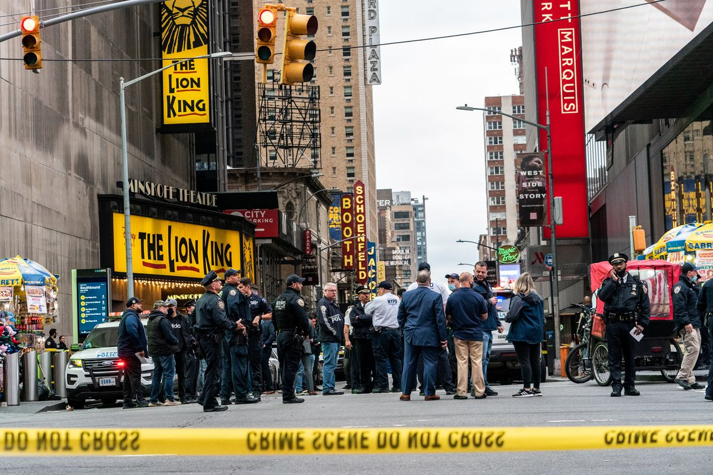

 

## Motivation

Living in NYC, news about violence, crimes, and different types of danger surrounds us all the time. Out of those crimes, the shooting incidents concerns us the most because of its life-threatening nature. 
So, for this project, we are motivated to explore the shooting incidents in NYC, analyze general trends and characteristics of those incidents, and find risk factors that are potentially associated with them. By doing so, we hope to find some information on how to keep our own safety and avoid risky times, areas, and factors that are closely related to shooting incidents.We hope the audience of our website will learn useful information about the profiles of shooting incidents, be aware of them, and stay safe!

## Screencast

